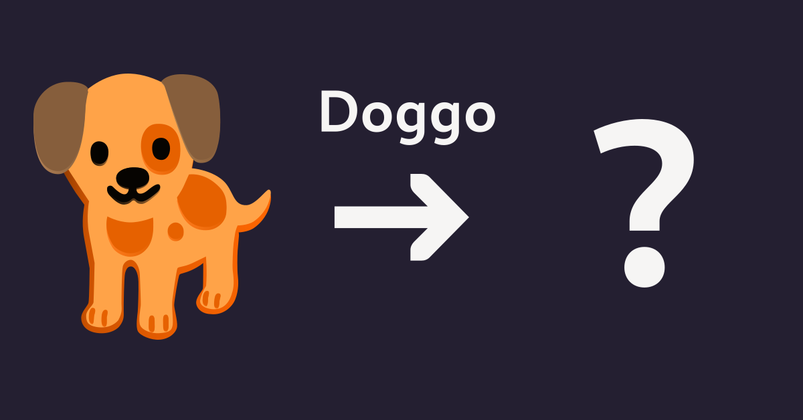

+++
title = "Doggo 4.1 on Flathub Guidelines"
description = "A Minor... &amp; Major Release?"
date = 2024-01-28
draft = true
authors = ["Dexter Reed"]
[taxonomies]
tags = ["Flathub", "Release", "Redesign", "Doggo", "4.1"]
[extra]
toc = true
archive = "This Post has been scrapped."

[extra.comments]
host = "toot.community"
id = ""
user = "sungsphinx"
+++

<figcaption>Doggo -> ?</figcaption>

## What?
So... Flathub released <a href="https://docs.flathub.org/blog/quality-moderation">their new metadata guidelines</a>, and Doggo was failing <b><i>4 checks</i></b>
