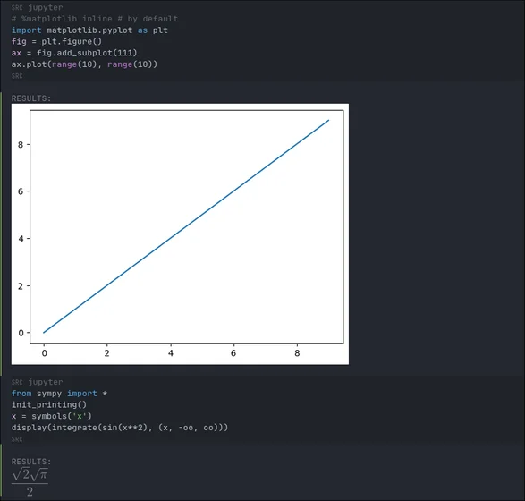
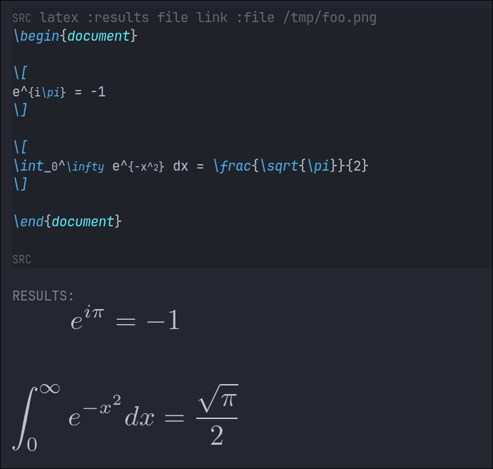
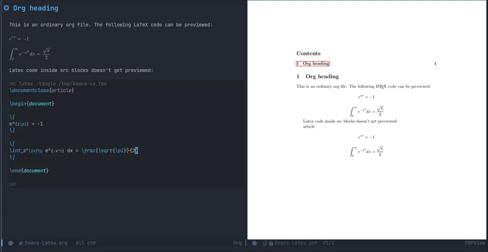

Why use Jupyter notebooks when you can connect to a kernel directly from
within Org mode in Emacs?

# Configure `texlive`

I'm on Arch *BTW*, and i don't like the `texlive-basic`,
`texlive-full` and `texlive-bin` packages that are present in the Arch
repos. So I'll be setting up a local Texlive installation in this
section. I've symlinked (to `/usr/local/bin`) some binaries
that Emacs requires. *I* didn't add the entire installation folder to
`PATH` because it adds a lot of executables to my `fish`
autosuggestions.

``` bash
mkdir - p ~/.Texlive
wget https://mirror.ctan.org/systems/texlive/tlnet/install-tl-unx.tar.gz
unzip install-tl-unx.tar.gz # note that unzip can be installed using `pacman -S unzip
./install-tl --texdir ~/.Texlive
sudo ln -sf ~/.Texlive/bin/x86_64-linux/dvipng /usr/local/bin
sudo ln -sf ~/.Texlive/bin/x86_64-linux/latex /usr/local/bin
sudo ln -sf ~/.Texlive/bin/x86_64-linux/pdflatex /usr/local/bin
```

# Org mode settings

Org-mode ~~does need~~ could do with some configuration to accomodate
LaTeX previews. Note that the steps below will be applicable only to the
*graphical* version of Emacs.

```lisp
(setq org-src-preserve-indentation nil
      org-export-wth-toc nil
      org-src-tab-acts-natively t
      org-confirm-babel-evaluate nil
      org-startup-indented t
      org-return-follows-link t
      org-hide-emphasis-markers t)
(add-to-list 'org-babel-after-execute-hook (function org-latex-preview))
```

## Better defaults

```lisp
(defvar org-babel-default-header-args '((:results . "output") (:noweb . "yes")))

(defvar org-babel-default-header-args:jupyter '((:results . "output") (:kernel . "python3") (:session . "hello") (:async . "yes")))

(defun org-enter-maybe-execute ()
  (interactive)
  (if (org-in-src-block-p)
      (org-babel-execute-src-block)
    (newline)))

(org-babel-do-load-languages
 'org-babel-load-languages
 '((emacs-lisp . t)
   ;; (C . t)
   ;; (python . t)
   ;; (css . t)
   ;; (jupyter . t)
   (shell . t)))
```

This makes it convenient to use `Jupyter` src blocks within Emacs. Note
that `emacs-jupyter` needs to be set up for this. I've also
set a custom size for the LaTeX (and image, e.g plot) previews here.

``` lisp
(use-package jupyter
  :config
  ;; (org-babel-jupyter-override-src-block "python") ;; always use jupyter mode (even in python source blocks)
  (setq ob-async-no-async-languages-alist '("python" "jupyter-python"))
  (setq-local org-image-actual-width '(1024)))
```

# Org mode LaTeX configuration

`Org-fragtog` is a package that brings [on-hover]{.underline}
LaTeX preview functionality to Emacs. This *requires* a local LaTeX
environment such as the one I'm using. The configuration below loads
LaTeX previews when a file is opened.

``` lisp
(use-package latex-preview-pane)
(use-package org-fragtog
  :after org 
  :config (setq org-preview-latex-image-directory (concat (getenv "HOME") "/.cache"))
  ;; :custom (org-startup-with-latex-preview t)
  :hook (org-mode . org-fragtog-mode)
  :hook (org-babel-after-execute . org-redisplay-inline-images) ;; render plots automatically
  :custom
      (org-format-latex-options
        (plist-put org-format-latex-options :scale 2)
        (plist-put org-format-latex-options :foreground 'auto)
        (plist-put org-format-latex-options :background 'auto)))
```

This automatically configures LaTeX previews for us because the Jupyter
kernel supports `%matplotlib inline`.

# Conda

I'm using `Anaconda` for ML work, and so I've configured
Emacs to auto-load my `ML` environment (in which I've installed the
`Jupyter` packages). I've installed *miniconda* to
`~/.miniconda` and so i've set these variables accordingly,
you'd have to modify these values based on your prefix.

``` lisp
(use-package conda
  :config
  (setq conda-anaconda-home (expand-file-name (concat (getenv "HOME") "/.miniconda/"))
        conda-env-home-directory (expand-file-name (concat (getenv "HOME") "/.miniconda/"))
      conda-env-subdirectory "envs"))

(unless (getenv "CONDA_DEFAULT_ENV")
  (conda-env-activate "ML"))
```

# PDF Org-export previews

[pdf-tools](https://github.com/vedang/pdf-tools) is a replacement of
DocView for viewing PDF files inside Emacs. It uses the
`poppler` library, which also means that 'pdf-tools' *can*
be used to modify PDFs. This requires the `poppler` library, and so it
must be installed (in my case, using `pacman`). This also brings PDF
editing abilities to Emacs - which I *guess* isn't available in DocView
mode. This uses `epdfinfo` under the hood and renders PDFs quite well.
I'm pleased enough to make this my system-wide PDF editor.

``` lisp
(use-package pdf-tools
  :init (pdf-loader-install)
  :config (add-to-list 'revert-without-query ".pdf")
  :hook (pdf-view-mode-hook  . (lambda () (interactive) (display-line-numbers-mode -1))))
```

# Conclusion

Whoops, did i forget images? Here ya go:







Ok then, I'll be back with some Emacs content in the near future. Stay
tuned!
