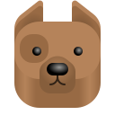

+++
title = "Projects"
description = "Projects being worked on or created by Silly Org"
+++

## Projects
Dogs FTW

   <a class="inline-button" href="https://flathub.org/apps/app.drey.Doggo">
     <picture class="full drop-shadow">
       
     </picture>
     <small>Doggo</small>
   </a>

   <a class="inline-button" href="https://codeberg.org/SOrg/Dogger">
     <picture class="full drop-shadow">
       
     </picture>
     <small>Dogger</small>
   </a>

